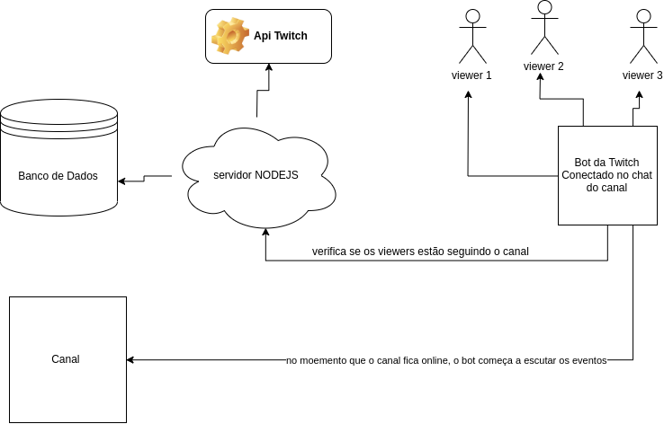

<h1 align="center"> OBS-widgets </h1>
<p align="center"> Conjunto de ferramentas para transmissões. </p>

# `chat-ao-vivo`
> Projeto para mostrar em tempo real o chat na transmissão.

Exemplo:


# `easter-egg` (em desenvolvimento)
> Sistema para os espectadores encontrar palavras escondidas no chat e receber prêmios.

### 📖 Bibliotecas de referência / Reference Libraries

| Nome/Name   | Link          |
| ------------- | ------------- |
|  Doc TMI JS IRC  | https://github.com/tmijs/docs/blob/gh-pages/_posts/v1.4.2/2019-03-03-Commands.md#connect  |
| Doc Twitch Chat IRC | https://dev.twitch.tv/docs/irc |

### 🚀 Fácil e rápido
💡 Instale todos os pacotes do `package.json`.

```bash
$ npm instal
```
⚙️ Configure o arquivo `.env-example` e renomeie para `.env`.

### ❗ Objetivo Final / Final goal



## Guia de contribuição
Para contribuir, siga as instruções contidas no [guia de contribuição](CONTRIBUTING.md). Siga também nosso [código de conduta](CODE_OF_CONDUCT.md).
